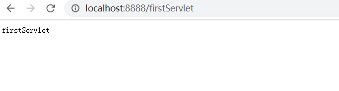

# Servlet过滤器的实现

## 一、过滤器

### 1.1 定义

Servlet 过滤器是可用于 Servlet 编程的 Java 类，有以下目的：

- 在客户端的请求访问后端资源之前，拦截这些请求。

- 在服务器的响应发送回客户端之前，处理这些响应。

### 1.2 使用场景

在实际的应用开发中，我们经常使用过滤器做以下的一些事情

- 基于一定的授权逻辑，对HTTP请求进行过滤，从而保证数据访问的安全。比如：判断请求的来源IP是否在系统黑名单中
- 对于一些经过加密的HTTP请求数据，进行统一解密，方便后端资源进行业务处理
- 或者我们社交应用经常需要的敏感词过滤，也可以使用过滤器，将触发敏感词的非法请求过滤掉
- Token验证、Session验证
- 点击率统计

过滤器主要的特点在于：一是可以过滤所有请求，二是它能够改变请求的数据内容。


**实现及注册方式一:利用WebFilter注解配置**

@WebFilter时Servlet3.0新增的注解，原先实现过滤器，需要在web.xml中进行配置，而现在通过此注解，启动启动时会自动扫描自动注册。

编写Filter类：

```java
//注册器名称为customFilter,拦截的url为所有
@WebFilter(filterName="customFilter",urlPatterns={"/*"})
@Slf4j
public class CustomFilter implements Filter{

    @Override
    public void init(FilterConfig filterConfig) throws ServletException {
        log.info("filter 初始化");
    }

    @Override
    public void doFilter(ServletRequest request, ServletResponse response, FilterChain chain)
            throws IOException, ServletException {
        log.info("customFilter 请求处理之前----doFilter方法之前过滤请求");
        //对request、response进行一些预处理
        // 比如设置请求编码
        // request.setCharacterEncoding("UTF-8");
        // response.setCharacterEncoding("UTF-8");

        //链路 直接传给下一个过滤器
        chain.doFilter(request, response);

        log.info("customFilter 请求处理之后----doFilter方法之后处理响应");
    }

    @Override
    public void destroy() {
        log.info("filter 销毁");
    }
}

```

然后在启动类加入@ServletComponentScan注解即可。
 使用这种方法当注册多个过滤器时，无法指定过滤器的先后执行顺序。原本使用web.xml配置过滤器时，是可指定执行顺序的，但使用@WebFilter时，没有这个配置属性的(需要配合@Order进行)，所以接下来介绍下通过FilterRegistrationBean进行过滤器的注册。

> –小技巧–(2018-08-25修订)
>  通过过滤器的java类名称，进行顺序的约定，比如LogFilter和AuthFilter，此时AuthFilter就会比LogFilter先执行，因为首字母A比L前面。

**注册方式二：FilterRegistrationBean方式**

FilterRegistrationBean是springboot提供的，此类提供setOrder方法，可以为filter设置排序值，让spring在注册web filter之前排序后再依次注册。

首先要改写filter, 其实就删掉@webFilter注解即可，其他的都没有变化。然后的代码是Filter的注册代码

```java
@Configuration
public class FilterRegistration {
    @Bean
    public FilterRegistrationBean filterRegistrationBean() {
        FilterRegistrationBean registration = new FilterRegistrationBean();
        //Filter可以new，也可以使用依赖注入Bean
        registration.setFilter(new CustomFilter());
        //过滤器名称
        registration.setName("customFilter");
        //拦截路径
        registration.addUrlPatterns("/*");
        //设置顺序
        registration.setOrder(10);
        return registration;
    }
}
```

注册多个时，就注册多个FilterRegistrationBean即可,启动后，效果和第一种是一样的。可以访问应用内的任意资源进行过滤器测试，因为过滤器是针对所有的请求和响应。可以输入Filter中的log信息。

## 二、servlet

### 2.1定义：

在java程序员10年以前做web开发的时候，所有的请求都是由servlet来接受并响应的。每一个请求，就要写一个servlet。这种方式很麻烦，大家就想能不能根据请求的路径以及参数不同，映射到不同的方法上去执行，这样就可以在一个servlet类里面处理多个请求，每个请求就是一个方法。这个思想后来就逐渐发展为structs、SpringMVC等框架。

### 2.2使用场景

目前来看，servlet使用的场景已经被springMVC封装架构全面覆盖，几乎没有什么需要使用原始servlet进行开发的场景。但是不排除，老项目向spring boot项目迁移融合，需要支持servlet的情况。

### 2.3 实现

下面我们就看一下，在spring boot里面如何实现servlet。

```
@WebServlet(name = "firstServlet", urlPatterns = "/firstServlet") //标记为servlet，以便启动器扫描。
public class FirstServlet extends HttpServlet {

    @Override
    protected void doGet(HttpServletRequest req, HttpServletResponse resp) throws ServletException, IOException {
        resp.getWriter().append("firstServlet");
    }

}
```

然后在启动类加入@ServletComponentScan注解即可。访问测试结果如下：


SpringMVC controller 是对servlet的封装

```java
package com.baron.servlet.controller;

import com.alibaba.fastjson.JSON;
import lombok.extern.slf4j.Slf4j;
import org.springframework.web.bind.annotation.RequestMapping;
import org.springframework.web.bind.annotation.RestController;

import javax.servlet.http.HttpServletRequest;
import javax.servlet.http.HttpSession;
/**
 * @Description: listener\filter测试入口
 * @Author: zhanwang
 * @Date: 2021/1/18
*/

@Slf4j
@RequestMapping("/servlet")
@RestController
public class RunTest {

    @RequestMapping("/test")
    public String test(HttpServletRequest req, HttpSession ses){

        //操作Attribute
        req.setAttribute("reqAttribute","one");
        req.setAttribute("reqAttribute","two");
        req.removeAttribute("reqAttribute");

        //操作session
        ses.setAttribute("seqAttribute","three");
        ses.getAttribute("seqAttribute");
        ses.invalidate();

        //
        return "ok";
    }
}
```


