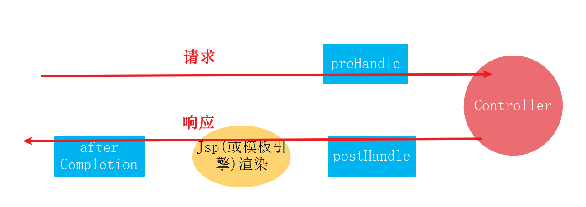
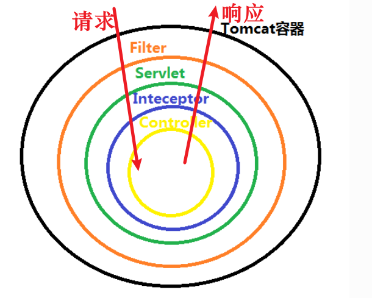
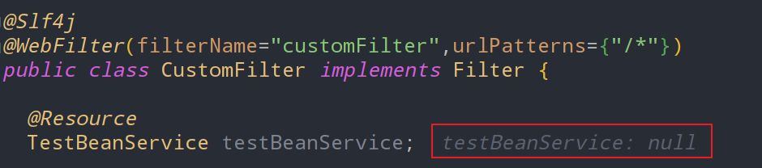
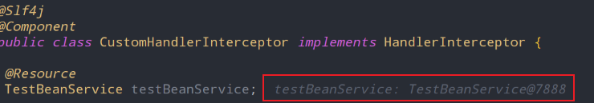
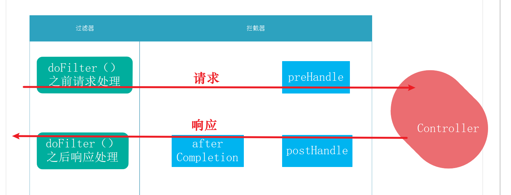

# spring拦截器及请求链路说明

## 一、拦截器Interceptor

在 Servlet 规范中并没有拦截器的概念，它是在Spring框架内衍生出来。



Spring中拦截器有三个方法：

- preHandle 表示被拦截的URL对应的控制层方法，执行前的自定义处理逻辑
- postHandle 表示被拦截的URL对应的控制层方法，执行后的自定义处理逻辑，此时还未将modelAndView进行页面渲染。
- afterCompletion 表示此时modelAndView已做页面渲染，执行拦截器的自定义处理。

## 二、拦截器与过滤器的核心区别

从请求处理的生命周期上看，拦截器Interceptor和过滤器filter的作用是类似的。过滤球能做的事情，拦截器几乎也都能做。



但是二者使用场景还是有一些区别的：

- 规范不同：Filter是在Servlet规范中定义的组件，在servlet容器内生效。而拦截器是Spring框架支持的，在Spring 上下文中生效。
- 拦截器可以获取并使用Spring IOC容器中的bean，但过滤器就不行。因为过滤器是Servlet的组件，而IOC容器的bean是Spring框架内使用，拦截器恰恰是Spring框架内衍生出来的。
- 拦截器可以访问Spring上下文值对象，如ModelAndView，过滤器不行。基于与上一点同样的原因。
- 过滤器在进入servlet容器之前处理请求，拦截器在servlet容器之内处理请求。过滤器比拦截器的粒度更大，比较适合系统级别的所有API的处理动作。比如：权限认证，Spring Security就大量的使用了过滤器。
- 拦截器相比于过滤器粒度更小，更适合分模块、分范围的统一业务逻辑处理。比如：分模块的、分业务的记录审计日志。（后面在日志的管理的那一章，我们会为介绍使用拦截器实现统一访问日志的记录）

比如说：我们在Filter中使用注解，注入一个测试service，结果为null。因为过滤器无法使用Spring IOC容器bean。



## 三、拦截器的实现

编写自定义拦截器类，此处我们用一个简单的例子让大家了解拦截器的生命周期。后面在日志的管理的那一章，我们会为介绍使用拦截器实现统一访问日志的记录的实战。

```java
package com.baron.servlet.interceptor;

import lombok.extern.slf4j.Slf4j;
import org.springframework.web.servlet.HandlerInterceptor;
import org.springframework.web.servlet.ModelAndView;

import javax.servlet.http.HttpServletRequest;
import javax.servlet.http.HttpServletResponse;

@Slf4j
@Component
public class CustomHandlerInterceptor implements HandlerInterceptor {
    @Override
    public boolean preHandle(HttpServletRequest request, HttpServletResponse response, Object handler)
            throws Exception {
        log.info("preHandle:请求前调用");
        //返回 false 则请求中断
        return true;
    }

    @Override
    public void postHandle(HttpServletRequest request, HttpServletResponse response, Object handler,
                           ModelAndView modelAndView) throws Exception {
        log.info("postHandle:请求后调用");

    }

    @Override
    public void afterCompletion(HttpServletRequest request, HttpServletResponse response, Object handler, Exception ex)
            throws Exception {
        log.info("afterCompletion:请求调用完成后回调方法，即在视图渲染完成后回调");

    }
}

```

通过继承WebMvcConfigurerAdapter注册拦截器。笔者在写作完成后，发现WebMvcConfigurerAdapter类已经被废弃，请实现WebMvcConfigurer接口完成拦截器的注册。

```java
package com.baron.servlet.interceptorconfig;

import com.baron.servlet.interceptor.CustomHandlerInterceptor;
import org.springframework.context.annotation.Configuration;
import org.springframework.web.servlet.config.annotation.InterceptorRegistry;
import org.springframework.web.servlet.config.annotation.WebMvcConfigurer;

import javax.annotation.Resource;

@Configuration
//废弃：public class MyWebMvcConfigurer extends WebMvcConfigurerAdapter{
public class MyWebMvcConfigurer implements WebMvcConfigurer {
    @Resource
    CustomHandlerInterceptor customHandlerInterceptor;

    @Override
    public void addInterceptors(InterceptorRegistry registry) {
        //注册拦截器 拦截规则
        //多个拦截器时 以此添加 执行顺序按添加顺序
        registry.addInterceptor(customHandlerInterceptor).addPathPatterns("/*");
    }

}

```


如果我们在CustomHandlerInterceptor ，注入一个测试service，结果是可以正确依赖注入并使用该Service的。



## 四、请求链路说明

随便请求一个系统内的API（因为我们配置的过滤器拦截器拦截所有请求），通过输出结果分析一下拦截器、过滤器中各接口函数的执行顺序。

```
CustomFilter  : customFilter 请求处理之前----doFilter方法之前过滤请求
CustomHandlerInterceptor  : preHandle:请求前调用
CustomHandlerInterceptor  : postHandle:请求后调用
CustomHandlerInterceptor  : afterCompletion:请求调用完成后回调方法，即在视图渲染完成后回调
CustomFilter  : customFilter 请求处理之后----doFilter方法之后处理响应
```

请求链路调用顺序图如下所示：

