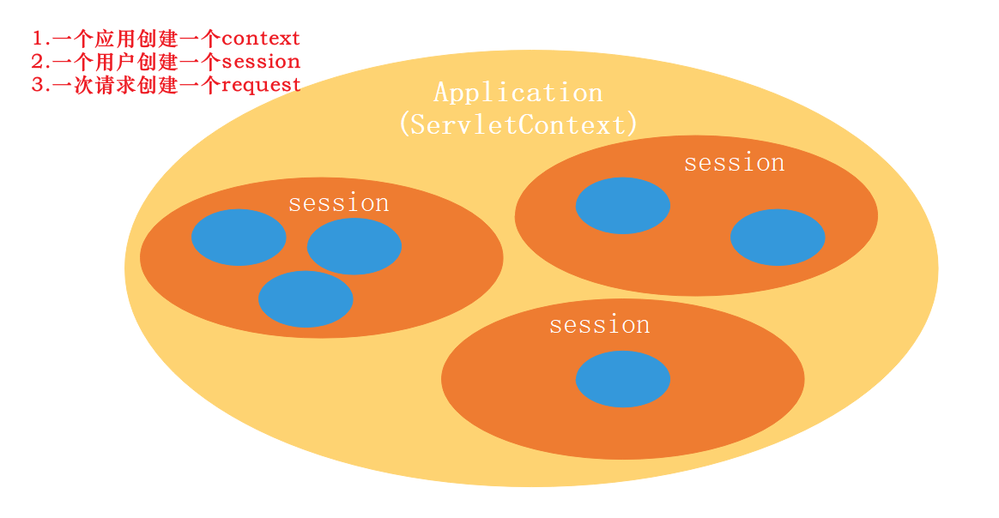

# Servlet域对象与属性变化监听

## 一、监听器定义与实现

### 1.1 定义

Servlet 监听器是 Servlet 规范中定义的一种特殊类，用于监听 ServletContext、HttpSession 和 ServletRequest 等作用域对象的创建与销毁事件，以及监听这些作用域对象中属性发生修改的事件。监听器使用了设计模式中的观察者模式，它关注特定事物的创建、销毁以及变化并做出回调动作，因此监听器具有异步的特性。

Servlet Listener 监听三大域对象的创建和销毁事件，三大对象分别是：
    
1、ServletContext Listener：application 级别，整个应用只存在一个，所有用户使用一个ServletContext

2、HttpSession Listener：session 级别，同一个用户的浏览器开启与关闭生命周期内使用的是同一个session

3、ServletRequest Listener：request 级别，每一个HTTP请求为一个request


    除了监听域对象的创建和销毁，还可以监听域对象中属性发生修改的事件。

- HttpSessionAttributeListener

- ServletContextAttributeListener

- ServletRequestAttributeListener

### 1.2 使用场景

Servlet 规范设计监听器的作用是在事件发生前、发生后进行一些处理，一般可以用来**统计在线人数和在线用户、统计网站访问量、系统启动时初始化信息等。**

### 1.3 监听器的实现

```java
package com.baron.servlet.listener;

import lombok.extern.slf4j.Slf4j;

import javax.servlet.*;
import javax.servlet.annotation.WebListener;
import javax.servlet.http.HttpSessionEvent;
import javax.servlet.http.HttpSessionListener;

@Slf4j
@WebListener
public class CustomListener implements  ServletContextListener,
        ServletRequestListener,
        HttpSessionListener,
        ServletRequestAttributeListener {

    @Override
    public void contextInitialized(ServletContextEvent se) {
        log.info("==============context创建");
    }

    @Override
    public void contextDestroyed(ServletContextEvent se) {
        log.info("==============context销毁");
    }


    @Override
    public void requestDestroyed(ServletRequestEvent sre) {
        log.info(" ++++++++++++++++++request监听器：销毁");
    }

    @Override
    public void requestInitialized(ServletRequestEvent sre) {
        log.info(" ++++++++++++++++++request监听器：创建");
    }


    @Override
    public void sessionCreated(HttpSessionEvent se) {
        log.info("----------------session创建");
    }

    @Override
    public void sessionDestroyed(HttpSessionEvent se) {
        log.info("----------------session销毁");
    }


    public void attributeAdded(ServletRequestAttributeEvent srae) {

        log.info("----------------attributeAdded");
    }

    public void attributeRemoved(ServletRequestAttributeEvent srae) {
        log.info("----------------attributeRemoved");
    }

    public void attributeReplaced(ServletRequestAttributeEvent srae) {
        log.info("----------------attributeReplaced");
    }

}
```


- 实现**ServletRequestListener接口**，并重写requestDestroyed销毁和requestInitialized方法。一次ServletRequest的requestInitialized方法和requestDestroyed销毁方法的执行代表1次请求的接收与处理完毕。所以比较适合网站资源被访问次数的统计。
- 实现**HttpSessionListener接口**，并重写sessionInitialized初始化和sessionDestroyed销毁方法，可以监听session会话的开启与销毁（用户的上线与下线）。比如：可以用来实现在线用户数量的统计。

- 实现**ServletContextListener接口**，并重写contextInitialized初始化和contextDestroyed销毁方法，可以监听全局应用的初始化和销毁。比如：在系统启动的时候，初始化一些数据到内存中供后续使用。

- 实现**ServletRequestAttributeListener接口**（或HttpSessionAttributeListener或ServletContextAttributeListener）。可以监听到对应的作用域内数据属性的attributeAdded新增、attributeRemoved删除、attributeReplaced替换等动作。

### 1.4.全局Servlet组件扫描注解

在启动类中加入@ServletComponentScan进行自动注册即可。

## 二、监听器测试

定义如下的Controller进行访问测试：

```java
package com.baron.servlet.controller;

import org.springframework.web.bind.annotation.RequestMapping;
import org.springframework.web.bind.annotation.RestController;

import javax.servlet.http.HttpServletRequest;
import javax.servlet.http.HttpSession;

@RequestMapping("/servletlistener")
@RestController
public class SimpleTest {

    @RequestMapping("/test")
    public String test(HttpServletRequest req, HttpSession ses){
        //操作Attribute
        req.setAttribute("reqAttribute","one");
        req.setAttribute("reqAttribute","two");
        req.removeAttribute("reqAttribute");

        //操作session
        ses.setAttribute("seqAttribute","three");
        ses.getAttribute("seqAttribute");
        ses.invalidate();

        //
        return "ok";
    }
}
```


- 当应用启动的时候。“==============context创建”被打印出来，说明触发contextInitialized监听函数
- 访问“http://127.0.0.1:8084/servletlistener/test”， 断点断住，“ ++++++++++++++++++request监听器：创建”被打印出来，说明requestInitialized回调函数被触发

- 紧接着“----------------session创建”被打印出来，说明sessionCreated监听函数被触发

- 继续执行req.setAttribute("reqAttribute","one");，“----------------attributeAdded”被打印出来，说明attributeAdded监听函数被触发

- 继续执行req.setAttribute("reqAttribute","two");“----------------attributeReplaced”被打印出来，说明attributeReplaced监听函数被触发

- 继续执行完成req.removeAttribute("reqAttribute");“----------------attributeRemoved”被打印出来，说明attributeRemoved监听函数被触发

- 继续执行session.invalidate();，“----------------session销毁”被打印出来，说明sessionDestroyed监听函数被触发

- 将controller方法执行完成，"++++++++++++++++++request监听器：销毁"被打印出来，说明requestDestroyed监听函数被触发。

- 当停掉应用的时候，”==============context销毁”被打印出来，说明contextDestroyed监听函数被触发

从上面的打印结果看：作用域范围是context 大于 request 大于sesion，实际上并不是。因为我们手动的调用了session.invalidate();，session才会被销毁。正常情况下session的销毁是由servlet容器根据session超时时间等因素来控制的。

**所以正常的作用域生命周期 ServletContext > HttpSession > request**

> 在以上的断点监听测试中，会有一些多余的监听日志被打印，是Spring Boot系统默认的帮我们做一些属性的添加与删除设置，从而触发监听，请忽略掉它们。就看我们断点执行之后的那一条，和断点停住的前一条日志。
